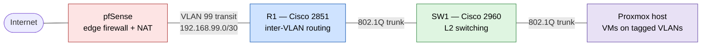

# Phase D — Integrating the Cisco Lab Behind a pfSense Firewall

In Phase 0, R1 and SW1 worked as a standalone CCNA-aligned lab — R1 connected
straight to the internet and did its own NAT. In Phase D, I integrated this
lab into my larger homelab, which already had a pfSense firewall and a
Proxmox hypervisor running several VMs.

## The change

**Before:** R1 sat at the edge of its own little network and did NAT to the
internet. SW1 supported three VLANs (Users, Servers, Management). Nothing
connected to my Proxmox VMs.

**After:** pfSense is the only thing facing the internet. R1 moved *behind*
pfSense and now just handles routing between internal VLANs. SW1 carries a
trunk both to R1 and to my Proxmox host, so VMs sit inside the VLANs as
first-class members.

## Topology

## VLANs

| VLAN | Name | Subnet | What's on it |
|---|---|---|---|
| 10 | Users | 10.0.10.0/24 | General-purpose clients |
| 20 | Servers | 10.0.20.0/24 | Proxmox host, Windows AD DC |
| 30 | DMZ | 10.0.30.0/24 | Docker host, Nextcloud |
| 40 | SecurityLab | 10.0.40.0/24 | Kali Linux |
| 99 | Transit | 192.168.99.0/30 | Just the R1 ↔ pfSense link |

## What I changed on R1

- Removed all the NAT config (`ip nat outside`, `ip nat inside`, the
  access-list, the `ip nat inside source` line). NAT now lives on pfSense.
- Shut down the old WAN port (Gi0/0).
- Added a new VLAN 40 subinterface for SecurityLab.
- Added a transit subinterface (Gi0/1.99) on the 192.168.99.0/30 link to
  pfSense. R1 takes 192.168.99.2, pfSense takes 192.168.99.1.
- Added a default route: `ip route 0.0.0.0 0.0.0.0 192.168.99.1` — anything
  R1 doesn't have a connected route for goes to pfSense.

## What I changed on SW1

- Added VLAN 40 and VLAN 99 to the VLAN database.
- Extended the existing trunk port (Fa0/1 to R1) to allow VLANs 40 and 99.
- Added a new trunk port (Gi0/1 to the Proxmox host) with the same
  hardening as the Phase 0 trunk: allowed VLANs 10/20/30/40/99, native
  VLAN 999, DTP off, BPDU guard, portfast trunk.

## How traffic flows now

When a VM tries to reach the internet:

1. VM sends a frame tagged with its VLAN onto the Proxmox virtual bridge.
2. The bridge sends it out the OptiPlex's NIC, into SW1.
3. SW1 forwards the frame across its trunk to R1.
4. R1 sees its own VLAN gateway address and routes the packet.
5. R1's default route sends it via the transit subnet to pfSense.
6. pfSense NATs the packet and forwards it to the internet.

Replies come back the same way in reverse.

## Verified

From the Proxmox host:
