# Cisco CCNA-Aligned Standalone Lab

A two-device enterprise network built on used Cisco hardware: a 2851 ISR router
and a 2960 Catalyst switch. Configured from scratch as a CCNA-aligned standalone
lab with three segmented VLANs, router-on-a-stick inter-VLAN routing, NAT/PAT,
DHCP, hardened Layer 2 security, and SSHv2 management.

End-to-end tested with a real client achieving full inter-VLAN routing and
internet connectivity.

## Topology

```mermaid
flowchart TD
    NET([Internet]) --- ISP[ISP / Upstream Router]

    ISP -- DHCP --> R1G00[Gi0/0<br/>WAN<br/>DHCP, NAT/PAT overload]

    subgraph R1[Cisco 2851 — R1<br/>IOS 15.1&#40;4&#41;M7]
        R1G00
        R1G01[Gi0/1 — trunk<br/>router-on-a-stick]
        R1V10[Gi0/1.10<br/>VLAN 10 gateway<br/>10.0.10.1/24<br/>DHCP pool]
        R1V20[Gi0/1.20<br/>VLAN 20 gateway<br/>10.0.20.1/24]
        R1V30[Gi0/1.30<br/>VLAN 30 gateway<br/>10.0.30.1/24]
        R1G01 --- R1V10
        R1G01 --- R1V20
        R1G01 --- R1V30
    end

    R1G01 == 802.1Q trunk<br/>allowed 10,20,30<br/>native VLAN 999 ==> SW1F01

    subgraph SW1[Cisco Catalyst 2960 — SW1]
        SW1F01[Fa0/1<br/>Trunk to R1]
        SW1V30[VLAN 30 SVI<br/>10.0.30.2/24<br/>SSH management]
        SW1A10[Fa0/2–8<br/>VLAN 10 access<br/>Users]
        SW1A20[Fa0/9–15<br/>VLAN 20 access<br/>Servers]
        SW1A30[Fa0/16–22<br/>VLAN 30 access<br/>Management]
        SW1UN[Fa0/23–48, Gi0/1–2<br/>UNUSED — VLAN 999, shutdown]
        SW1F01 --- SW1V30
        SW1F01 --- SW1A10
        SW1F01 --- SW1A20
        SW1F01 --- SW1A30
    end

    SW1A10 --- C1[VLAN 10 client<br/>e.g. workstation]
    SW1A30 --- C2[VLAN 30 admin<br/>SSH to R1/SW1]

    classDef router fill:#cfe3ff,stroke:#1f5fb4,stroke-width:2px,color:#000
    classDef switch fill:#dff5e1,stroke:#3a8c4a,stroke-width:2px,color:#000
    classDef host fill:#e8e1f5,stroke:#6a4ea8,stroke-width:1px,color:#000
    classDef edge fill:#f5d6c2,stroke:#b85c2a,stroke-width:1px,color:#000

    class R1,R1G00,R1G01,R1V10,R1V20,R1V30 router
    class SW1,SW1F01,SW1V30,SW1A10,SW1A20,SW1A30,SW1UN switch
    class C1,C2 host
    class NET,ISP edge
```



## Hardware

| Role | Device | Notes |
|---|---|---|
| Router | Cisco 2851 ISR | IOS 15.1(4)M7 (CompactFlash ROMMON recovery performed during initial bringup) |
| Switch | Cisco Catalyst 2960 (48-port) | IOS 12.2 |
| Console | Rocstar USB-to-serial (PL2303) → macOS `tio` | |

## VLAN and IP scheme

| VLAN | Name | Subnet | Gateway | Purpose |
|------|------|---------------|------------|----------|
| 10 | Users | 10.0.10.0/24 | 10.0.10.1 | General clients |
| 20 | Servers | 10.0.20.0/24 | 10.0.20.1 | Infrastructure hosts |
| 30 | Management | 10.0.30.0/24 | 10.0.30.1 | Admin access to R1/SW1 |
| 999 | UNUSED | — | — | Black-hole native VLAN; parks shut/unused ports |

Management addresses: R1 Gi0/1.30 = 10.0.30.1, SW1 VLAN 30 SVI = 10.0.30.2.

## Configuration highlights

### R1 (Cisco 2851)

- **WAN**: Gi0/0 DHCP from ISP, `ip nat outside`
- **LAN trunk**: Gi0/1 with three 802.1Q subinterfaces (`encapsulation dot1Q 10|20|30`), each acting as the gateway for its VLAN, `ip nat inside`
- **NAT/PAT**: `ip nat inside source list 1 interface Gi0/0 overload` translates all internal subnets to the WAN address
- **DHCP**: Pools per VLAN, default-router pointing at each subinterface, lease 7 days
- **SSHv2**: 2048-bit RSA key, `ip ssh version 2`, `transport input ssh` on VTYs
- **Local auth**: `username admin privilege 15 secret 5 …`

### SW1 (Cisco 2960)

- **Trunk to R1** (Fa0/1):
  - `switchport mode trunk`, `switchport nonegotiate` (DTP disabled — VLAN-hopping mitigation)
  - `switchport trunk allowed vlan 10,20,30` (VLAN 1 explicitly excluded)
  - `switchport trunk native vlan 999` (untagged frames hit a black hole)
  - `spanning-tree portfast trunk` + `spanning-tree bpduguard enable`
- **Access ports** (Fa0/2–22): per-VLAN assignment, `spanning-tree portfast` + `bpduguard enable`
- **Unused ports** (Fa0/23–48, Gi0/1–2): moved to VLAN 999 and administratively shut
- **Management**: VLAN 30 SVI at 10.0.30.2/24, `ip default-gateway 10.0.30.1`
- **SSHv2**: same hardening as R1; HTTP/HTTPS management disabled

### Layer 2 security posture

- DTP disabled on the trunk → no auto-negotiation that could be spoofed
- Native VLAN moved off VLAN 1 → blunts double-tagging attacks
- VLAN 1 removed from the trunk allowed list → no accidental exposure
- BPDU guard on every edge port → loops or rogue switches err-disable the port
- All unused ports shut and parked in an unused VLAN
- Management plane on a dedicated VLAN, SSHv2 only, no HTTP

## Verification

A MacBook connected to a VLAN 10 access port (Fa0/2) was used as the test
client. All checks passed:

```text
$ ifconfig | grep "inet 10"
inet 10.0.10.2 netmask 0xffffff00 broadcast 10.0.10.255      # DHCP from R1

$ ping 10.0.10.1                                              # Gateway in own VLAN
2 packets transmitted, 2 received, 0.0% packet loss

$ ping 10.0.30.1                                              # Inter-VLAN routing
2 packets transmitted, 2 received, 0.0% packet loss

$ ping 8.8.8.8                                                # Internet via NAT
2 packets transmitted, 2 received, 0.0% packet loss
                                                              # TTL 117 — full path confirmed
```

What each test proved:

| Test | Validates |
|------|-----------|
| Client gets DHCP lease in 10.0.10.0/24 | Access port VLAN assignment, trunk tagging, R1 subinterface up, DHCP pool serving |
| `ping 10.0.10.1` | L2 + L3 within VLAN 10 |
| `ping 10.0.30.1` | Router-on-a-stick inter-VLAN routing |
| `ping 8.8.8.8` (TTL 117) | Default route, NAT/PAT, WAN reachability |

SSH from a VLAN 30 admin host into both R1 (10.0.30.1) and SW1 (10.0.30.2)
was also verified — remote management works end-to-end without console
access.

## Lessons learned

- **CompactFlash ROMMON recovery on the 2851.** The router shipped with an
  unbootable image. Recovery required pulling the CF card, copying a valid
  IOS image to it on a host machine, and reseating to break out of ROMMON.
  Worth knowing for any used-Cisco purchase.

- **SSH to old IOS from modern OpenSSH requires explicit cipher overrides.**
  IOS 15.1(4)M7 only offers SHA-1-based key exchange (`diffie-hellman-
  group14-sha1`), RSA host keys, CBC-mode ciphers (`aes256-cbc`), and
  `hmac-sha1` MACs. All four are disabled by default in modern OpenSSH
  (10.x). The solution is a per-host block in `~/.ssh/config`:

  ```ssh-config
  Host 10.0.10.1 10.0.20.1 10.0.30.1 10.0.30.2
      User admin
      KexAlgorithms +diffie-hellman-group14-sha1
      HostKeyAlgorithms +ssh-rsa
      PubkeyAcceptedAlgorithms +ssh-rsa
      Ciphers +aes256-cbc
      MACs +hmac-sha1
  ```

  Without `+` prefix on each option, the client *replaces* its defaults
  rather than appending — a subtle but important detail. The negotiation
  also fails one layer at a time (KEX → ciphers → MACs), so the fix needs
  all four directives at once or you'll hit the next error after solving
  the first.

- **Spanning-tree `Portfast Default is disabled` in `show spanning-tree
  summary`** refers only to the *global* default, not the per-interface
  configuration. Per-port `spanning-tree portfast` and `bpduguard enable`
  are still active; confirm with `show running-config interface <port>`.

## What's next

This lab is the standalone foundation. The next phase integrates it with
an existing pfSense + Proxmox environment as a "firewall-edge + Cisco-core"
design — pfSense remains the WAN edge, while R1 and SW1 become the internal
routed/switched core carrying VM traffic over an 802.1Q trunk to the
hypervisor. Windows AD will then be deployed on the stable, final-state
network.

## Skills demonstrated

- Cisco IOS configuration: VLANs, 802.1Q trunking, subinterfaces, DHCP,
  NAT/PAT, ACLs, SSH, SVIs
- Router-on-a-stick inter-VLAN routing design
- Layer 2 security hardening (DTP, native VLAN, BPDU guard, port lockdown)
- Out-of-band recovery (ROMMON, CompactFlash IOS restoration)
- SSH negotiation troubleshooting against legacy crypto
- End-to-end verification with a real client
